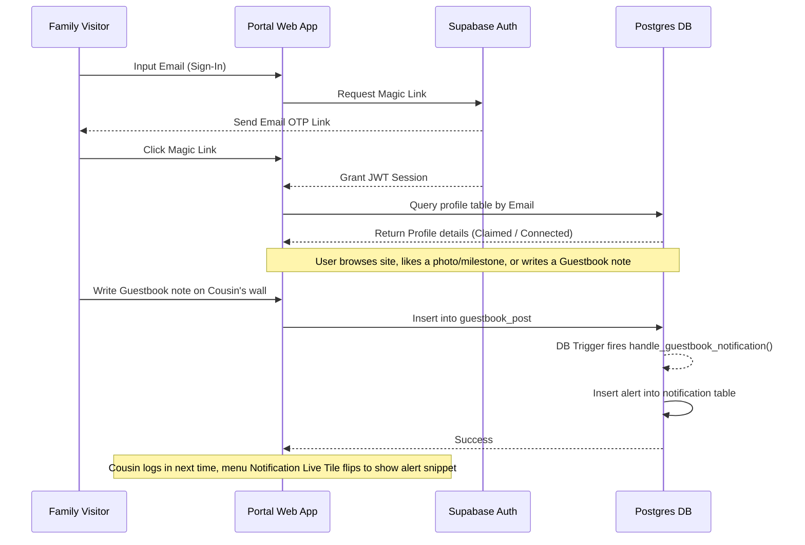

# 🌳 Family Reunion Portal — Master System Specs & Roadmap to v1.0

This document serves as the single source of truth for the goals, visual vision, database layout, and step-by-step implementation specs to reach **Release 1.0**. It is written to guide both human developers and autonomous coding agents.

---

## 🧭 Part 1: The Vision & Visual Identity
The Family Reunion Portal is a private web experience optimized for mobile screens.

### 🎨 Visual Theme
*   **Color Palette**: Harmonious dark mode utilizing a plum-burgundy base (`#4a1934`), warm amber-gold highlights (`#F7DC92`), and soft peach accents (`#EABEA9`).
*   **Layout**: Cards with blurred glassmorphism (`backdrop-filter: blur(10px)`), high contrast, thin borders (`rgba(243, 231, 177, 0.2)`), and smooth animations (spring animations, diagonal flips, and fade-in sweeps).
*   **Typography**: Clean sans-serif typography (e.g., *Titillium Web* or *Inter*).

### 🔄 The UI Experience Loop


---

## 🗄️ Part 2: Database Architecture v2

The database is built on top of the legacy `20240623194638_usermanagement.sql` baseline. Consolidating the v2 updates yields the following database schema:

```
                  ┌───────────────────────┐
                  │        profile        │
                  ├───────────────────────┤
                  │ id (PK)               │
                  │ email (Unique)        │
                  │ firstname, nickname   │
                  │ lastname, avatar_url  │
                  │ sunrise, sunset       │
                  │ parent, ancestor      │
                  │ branch (Int)          │
                  └──────────┬────────────┘
                             │
            ┌────────────────┴────────────────┐
            ▼                                 ▼
┌───────────────────────┐           ┌───────────────────────┐
│       milestone       │           │    guestbook_post     │
├───────────────────────┤           ├───────────────────────┤
│ id (PK)               │           │ id (PK)               │
│ profile_id (FK)       │           │ profile_id (FK)       │
│ category, subcategory │           │ author_id (FK)        │
│ title, event_date     │           │ content (max 240)     │
│ location, photo_url   │           │ location, event_date  │
│ likes_count (Cached)  │           │ likes_count (Cached)  │
└───────────┬───────────┘           └───────────┬───────────┘
            │                                   │
            ├─────────────────┬─────────────────┘
            ▼                 ▼
┌───────────────────────┐   ┌───────────────────────┐
│         likes         │   │     notification      │
├───────────────────────┤   ├───────────────────────┤
│ id (PK)               │   │ id (PK)               │
│ user_id (FK)          │   │ recipient_id (FK)     │
│ target_type (Enum)    │   │ actor_id (FK)         │
│ target_id             │   │ action_type (Enum)    │
│ UNIQUE(u_id, t_type,  │   │ target_id, is_read    │
│        t_id)          │   └───────────────────────┘
└───────────────────────┘
```

### Table Definitions & Constraints
1.  **`profile` (Base table altered)**
    *   `email TEXT UNIQUE`: Holds the user's primary connection email. Used to claim profiles and assign permissions.
2.  **`milestone`**
    *   `category TEXT CHECK (category IN ('education', 'military', 'faith', 'relationship', 'general'))`
    *   `likes_count INTEGER DEFAULT 0`: Cached counter updated automatically via DB trigger.
3.  **`media`**
    *   `media_type TEXT DEFAULT 'photo' CHECK (media_type IN ('photo', 'video'))`
    *   `decade TEXT CHECK (decade IN ('1980s and older', '1990s', '2000s', '2010s', 'Today'))`
    *   `likes_count INTEGER DEFAULT 0`, `comments_count INTEGER DEFAULT 0` (Cached counters).
4.  **`likes` (Unified Table)**
    *   `target_type TEXT CHECK (target_type IN ('milestone', 'media', 'guestbook_post'))`
    *   `UNIQUE (user_id, target_type, target_id)`: Prevents duplicate liking of any item.

### Storage Buckets Setup
*   `avatars` (Public): Profile avatars. Path format: `profile_id.jpg`.
*   `milestones` (Public): Timeline event photos. Path format: `profile_id/milestone_id.jpg`.
*   `profile-media` (Public): General photo/video uploads. Path format: `profile_id/media_id.jpg` or `profile_id/media_id.mp4`.

---

## 🗺️ Part 3: Site Map & Information Architecture

The website is composed of 6 main slide sections on the homepage, 1 profile card screen, and 3 feed pages.

```
HomePage (NewHome.js) [Snap-scroll slides]
 ├── Slide 1: Hero Cover (NewHeroSection.js)
 ├── Slide 2: Root Branch Welcome & Generation Plaque (NewRootBranchSection.js)
 ├── Slide 3: Your Lineage Path (NewCombinedDemoSection.js)
 ├── Slide 4: Family Photo Mosaic (NewMosaicSection.js)
 ├── Slide 5: Pulse Activity Highlights (PulseHighlightsSection.js)
 └── Slide 6: Member Search & Filter (NewSearchSection.js)

Navigation Menu (NewLayout.js Grid)
 ├── TREE (Left Column)               ├── PULSE (Right Column)
 │    ├── Interactive Tree            │    ├── Notifications [Live flipping tile!]
 │    ├── Timeline Tree               │    ├── Family Milestones [MilestonesPage.js]
 │    ├── Calendar Tree               │    ├── Family Media [FamilyMediaPage.js]
 │    └── Search Members              │    └── Family Profiles

Profile Page (NewProfile.js) [Two Columns bottom row]
 ├── Top: Portrait, sunrise/sunset, generation badge
 ├── Bottom Drawer Left: Milestones Timeline Drawer
 ├── Bottom Drawer Right: Immediate Family Drawer
 ├── Bottom Row Left Column: Tribute Guestbook Drawer
 └── Bottom Row Right Column: Media Photo/Video Drawer
```

---

## 🛠️ Part 4: Profile Page Implementation Plan (Multiple Agent Spec)

This section divides the remaining Profile Page tasks into 3 distinct, highly detailed assignments that can be worked on concurrently by separate coding agents.

---

### 👤 Agent A: Guestbook Integration & Email Permissions Setup
*   **Goal**: Replace the deprecated twilio/phone permission logic with email-based mappings, connect the composer, and implement guestbook updates.
*   **Files**:
    *   [NewProfile.js](file:///c:/Users/qtiph/OneDrive/Desktop/Deploy/FamilyReunion/familyreunion/src/newComponents/NewProfile.js)
    *   [GuestbookComposer.js](file:///c:/Users/qtiph/OneDrive/Desktop/Deploy/FamilyReunion/familyreunion/src/newComponents/GuestbookComposer.js)
    *   [GuestbookPostCard.js](file:///c:/Users/qtiph/OneDrive/Desktop/Deploy/FamilyReunion/familyreunion/src/newComponents/GuestbookPostCard.js)

#### 📝 Task Details
1.  **Email Authorization Linkage**:
    *   Ensure the select query on `profile` includes `email` (we updated this in line 664, make sure it is fully utilized).
    *   The `canEdit` logic must evaluate:
        ```javascript
        const hasNoEmailTied = !data.email;
        const canEdit = session && (
          (isCurrentUser && !isDeceased) ||
          (isDirectRelation && (isDeceased || hasNoEmailTied))
        );
        ```
2.  **Compose & Post Wireframe**:
    *   Ensure [GuestbookComposer.js](file:///c:/Users/qtiph/OneDrive/Desktop/Deploy/FamilyReunion/familyreunion/src/newComponents/GuestbookComposer.js) receives the `currentUser` object (which is `profile` from `AuthConsumer()`) to fetch the logged-in user's name and avatar.
    *   Add a character counter in the composer (`max: 240 characters`).
    *   Verify the `onPostCreated` callback inserts the newly created post directly into local profile states (`setTributes`) so it renders instantly without needing a full-page refresh.
3.  **Liking & Counter Operations**:
    *   Pass the `liked` boolean to `GuestbookPostCard` by checking if the post ID is in the local `likedGuestbookPostIds` state.
    *   When the like icon is tapped, invoke the unified database `likes` insert/delete action:
        *   Insert target: `target_type: 'guestbook_post'`, `target_id: post.id`.
        *   Upon success, update `likedGuestbookPostIds` array and increment/decrement the card's local `likes_count` state to align with the backend triggers.

---

### 📷 Agent B: Media Gallery, Polaroid Carousel, and 6s Video Upload Validator
*   **Goal**: Implement the Photo/Video Gallery drawer featuring a visual polaroid layout, a decade slider, comment overlays, and client-side upload video duration limits.
*   **Files**:
    *   [NewProfile.js](file:///c:/Users/qtiph/OneDrive/Desktop/Deploy/FamilyReunion/familyreunion/src/newComponents/NewProfile.js)
    *   [MediaLiveTile.js](file:///c:/Users/qtiph/OneDrive/Desktop/Deploy/FamilyReunion/familyreunion/src/newComponents/MediaLiveTile.js)

#### 📝 Task Details
1.  **Browser Video Length Test**:
    *   Inside the media upload handler in `NewProfile.js`, check the file type. If the user selects a video file:
        *   Dynamically instantiate an offscreen HTML5 `<video>` element using `URL.createObjectURL(file)`.
        *   Listen for `onloadedmetadata`.
        *   If `video.duration > 6.1` seconds, block the upload, display an error message (`message.error("Videos must be 6 seconds or less!")`), and clear the file input.
2.  **Insert Gallery Media Row**:
    *   Upload validated files to the `profile-media` storage bucket path (`profile_id/media_id.ext`).
    *   Insert a row into the database table `media`:
        *   `media_type`: `'photo'` or `'video'` based on file MIME type.
        *   `decade`: Selected value from the selector ('1990s', 'Today', etc.).
        *   `caption`: Optional text input.
3.  **Polaroid Carousel & Decade Filters**:
    *   Apply decade filters to the gallery list using states.
    *   Style items inside the Media drawer container as polaroid cards (slight random rotations, thick bottom border for captions).
4.  **Comments Detail Overlay Modal**:
    *   Tapping a photo opens a full-screen overlay modal.
    *   Fetch comments from `media_comment` where `media_id = active_photo_id`.
    *   Support writing new comments and deleting comments (if owned by the commenter or target profile owner). Automatically update the comments count locally.

---

### 🏆 Agent C: Milestones Timeline Likes & Hearts
*   **Goal**: Integrate social interaction (likes) on milestone timeline cards.
*   **Files**:
    *   [NewProfile.js](file:///c:/Users/qtiph/OneDrive/Desktop/Deploy/FamilyReunion/familyreunion/src/newComponents/NewProfile.js)

#### 📝 Task Details
1.  **Fetch Milestone Likes State**:
    *   In the primary `fetchData` function of `NewProfile.js`, query the `likes` table for milestone rows created by the current user:
        ```javascript
        const { data: likesData } = await supabase
          .from("likes")
          .select("target_id")
          .eq("user_id", session.user.id)
          .eq("target_type", "milestone");
        ```
    *   Store these IDs in the existing `likedMilestoneIds` state array.
2.  **Timeline Card UI Integration**:
    *   Add a heart/like icon button in the header or footer of each timeline milestone card (exclude virtual birth and virtual death bookend cards).
    *   Render a filled heart if `likedMilestoneIds.includes(event.id)`, and an outlined heart otherwise.
    *   Display the milestone's cached `likes_count` next to the heart icon (e.g. `❤️ 12`).
3.  **Like Handler Implementation**:
    *   Add the logic function `handleMilestoneLikeToggle(milestoneId, isLiked)`:
        *   If `isLiked` (adding a like): Insert a row in the `likes` table with `target_type: 'milestone'`, `target_id: milestoneId`. Update local state `likedMilestoneIds` and increment the milestone's `likes_count` locally.
        *   If unliking: Delete the row from the `likes` table. Update local state `likedMilestoneIds` and decrement the milestone's `likes_count` locally.
