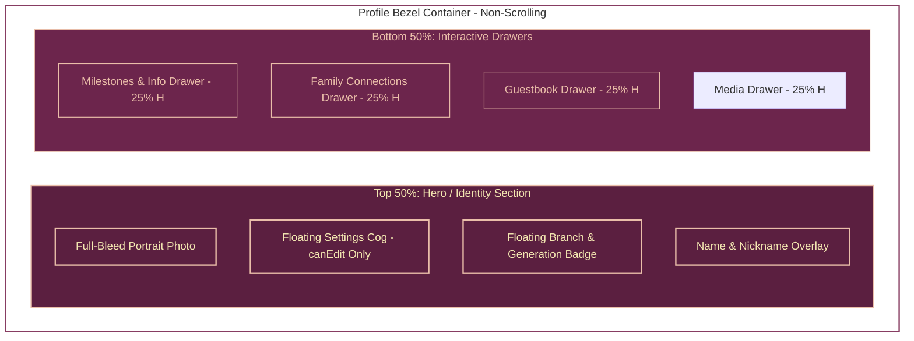
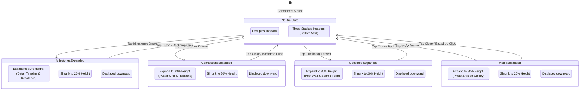

# Profile Card Redesign Specification: Contexts, States & Security

## Visual Representation & Interactive Flow

### Component Layout Map


### Drawer State Transitions


---

## 1. Core Visual Layout (50/50 Split)

The entire Profile page is bounded inside the app viewport with **zero vertical scrolling**. It consists of a top hero half and a bottom interactive drawer half.

```
+-----------------------------------+
|            [Settings]             |
|                                   |
|             HERO PHOTO            |
|             (Top 50%)             |
|                                   |
|   Name Overlay                    |
|   Generation & Lineage Badge      |
+-----------------------------------+
|                                   |
|   =============================   |
|   [Milestones & Info Drawer]  |   |
|   =============================   |   Expandable drawers (Bottom 50%)
|   [Family Connections Drawer] |   |   Tap slides selected drawer up
|   =============================   |   to cover 80% of card height
|   [Guestbook] │ [Media/Photos]    |
|   =============================   |
+-----------------------------------+
```

### Top 50% (Hero Photo & Identity)
*   **Media Display**: A full-bleed picture of the family member.
    *   *Self (no photo)*: Shows an active "Upload Photo" hover zone.
    *   *Other / Guest (no photo)*: Renders a high-end avatar placeholder with a gradient background using the brand colors (plum/gold).
*   **Name & Title**: Large serif/sans-serif overlay (bold gold/rose typography).
*   **Dynamic Lineage Badge**: Displays generation level and branch line (e.g., `4th Generation · Mary Line`).
*   **Settings Gear**: Floating in the corner. Clicking navigates to `/profileedit/:userId` (visible only to own active session).

### Bottom 50% (The Sliding Drawers)
*   Three stacked cards presenting live previews of data:
    1.  **Milestones & Info**: Shows current residence (City, State) and milestone snippet (e.g. `🎓 Graduated high school (2024)`).
    2.  **Connections**: Renders small round avatar bubbles representing linked parents, spouse, and children.
    3.  **Tribute Guestbook**: Shows a speech-bubble icon and the latest posted message.
*   **Slide-Up Takeover**: Clicking any drawer triggers a CSS-animated transition. The drawer grows to fill **80% height**, sliding over the hero image. It reveals extensive details and action inputs. Tapping a collapse button or the header slides it back down.

---

## 2. Contextual Permission Matrix

Features and interactive buttons adapt dynamically based on the viewer's session and relationship to the profile.

| Viewer State | Target Profile | Settings Cog | Complete profile prompts (e.g. Upload) | Connections Editing (Add/Remove) | Write Guestbook Post |
| :--- | :--- | :---: | :---: | :---: | :---: |
| **Logged In (Self)** | Own Active Profile | **Visible** | **Visible** (if incomplete) | **Visible** (triggers forms) | Hidden (cannot post on own wall) |
| **Logged In (Cousin)** | Other Living Profile | Hidden | Hidden | Hidden | **Visible** (form in drawer) |
| **Logged In (Cousin)** | Deceased Ancestor | Hidden | Hidden | Hidden | **Visible** (memorial posting) |
| **Unauthenticated Guest** | Any Profile | Hidden | Hidden | Hidden | Hidden (prompt to register) |

### Permission Calculation Rules
```javascript
const isCurrentUser = session?.user?.id === data.id;
const isDeceased = data.sunset !== null;
const isFirstBranchOrRoot = data.branch === 0 || data.branch === 1;

// Legacy ancestral/first-generation nodes are managed by seeding; self-edits are blocked
const isLegacyProfile = isDeceased || isFirstBranchOrRoot;

// canEdit governs profile settings, image changes, and residence/family updates
const canEdit = session && isCurrentUser && !isLegacyProfile;
```

---

## 3. Sourcing Legacy Database Plumbing

No existing database structures or page forms should be broken. The redesigned view will integrate existing tables and fields:

### A. Dynamic Lineage Badge
Sourced from `data.branch` (generation) and `data.ancestor_profile` (branch lineage):
*   **Branch Levels**:
    *   `0`: `"Roots · Founder"` (e.g. John Henry & Birdie Mae)
    *   `1`: `"1st Branch · [Firstname] Line"`
    *   `2`: `"3rd Gen · [Ancestor.Firstname] Line"`
    *   `3`: `"4th Gen · [Ancestor.Firstname] Line"`
    *   `4`: `"5th Gen · [Ancestor.Firstname] Line"`
*   The query loads the first-branch ancestor details automatically so we can append `"Line"` dynamically based on the ancestor name.

### B. Image Uploads
*   Triggered from the top photo block or the completed profile checks if `avatar_url` is missing.
*   Uses the existing bucket (`avatars`) and routes to the custom React cropper and uploader screen `/antavatar/:userId`.

### C. Residence & City/State Form
*   If missing and `canEdit` is true, a visual alert prompt will link to `/residenceform/:userId`.
*   Displays existing values from `profilestate` and state lookup table `state`.

### D. Adding Family Connections
*   Uses the interactive `InPlaceForm` overlays for `parent`, `spouse`, and `child` to maintain the existing relationship connections flow.
*   Saves the results into the `connection` table in both directions.

---

## 4. Guestbook v2 Specification

The Guestbook has been redefined as a **short-form social post wall**. See the full specification in `GuestbookSpec.md` for complete details on post structure, interactions, live tile faces, database schema, and API queries.

### Key Changes from Tribute System
- **240 character max** per post (forces brevity, casual tone)
- **@mentions** — tag other family members
- **Location & event date** optional metadata
- **Like and report** interactions
- **Cannot post on own wall** (self profiles are read-only for guestbook)
- **Live tile face rotation** — cycles through message preview, stat count, activity pulse, nostalgia moment, and mention spotlight faces

### Database Migration
- The old `tribute` table should be dropped or archived
- New table: `guestbook_post` with fields for content, tagged_profiles, location, event_date, likes_count, is_reported

### Layout Note
The bottom row is now split into two equal squares: **Guestbook (left)** and **Media (right)**.

---

## 5. Technical Component Architecture

The redesigned `Profile.js` will organize state like this:

```javascript
// Active Drawer state
const [activeDrawer, setActiveDrawer] = useState(null); // 'milestones' | 'connections' | 'guestbook' | 'media' | null

// In-place connection form state
const [showInPlaceForm, setShowInPlaceForm] = useState(false);
const [formMode, setFormMode] = useState("parent");
```

### JSX Structure Mockup
```jsx
<div className="profile-bezel-card">
  {/* TOP HALF: Hero & Info */}
  <div className="profile-hero-section">
    {/* Photo Block */}
    <div className="profile-photo-container">
      
      {canEdit && <button onClick={goToAvatar} className="photo-edit-btn">Change Photo</button>}
    </div>
    
    {/* Top Right: Settings Gear */}
    {canEdit && <SettingOutlined className="settings-cog" onClick={goToEdit} />}
    
    {/* Identity Overlay */}
    <div className="profile-identity-overlay">
      <span className="profile-badge">{generationBadgeText}</span>
      <h1 className="profile-name">{firstname} {lastname}</h1>
      {nickname && <span className="profile-nickname">"{nickname}"</span>}
    </div>
  </div>

  {/* BOTTOM HALF: Slide Drawers */}
  <div className="profile-drawers-container">
    {/* 1. Milestones Drawer */}
    <div className={`profile-drawer milestones ${activeDrawer === 'milestones' ? 'expanded' : ''}`}>
      <div className="drawer-header" onClick={() => toggleDrawer('milestones')}>
        <span>Life Milestones</span>
        <span className="drawer-preview">{residenceText} · {milestonesCount} milestones</span>
      </div>
      <div className="drawer-content">
        {/* Detailed Milestones Timeline */}
        {/* Residence Edit Prompt (if canEdit) */}
      </div>
    </div>

    {/* 2. Connections Drawer */}
    <div className={`profile-drawer connections ${activeDrawer === 'connections' ? 'expanded' : ''}`}>
      <div className="drawer-header" onClick={() => toggleDrawer('connections')}>
        <span>Family Connections</span>
        <div className="drawer-preview-avatars">
          {/* List of small circular avatars */}
        </div>
      </div>
      <div className="drawer-content">
        {/* Detailed links for Parents, Spouse, Children */}
        {/* Add Connection buttons (if canEdit) */}
      </div>
    </div>

    {/* 3. Guestbook Drawer */}
    <div className={`profile-drawer guestbook ${activeDrawer === 'guestbook' ? 'expanded' : ''}`}>
      <div className="drawer-header" onClick={() => toggleDrawer('guestbook')}>
        <span>Guestbook</span>
        <span className="drawer-preview">💬 {postCount} notes</span>
      </div>
      <div className="drawer-content">
        {/* Post feed wall */}
        {/* Inline composer (if logged in, isCurrentUser === false) */}
        {/* Auth Sign-in CTA (if guest) */}
      </div>
    </div>

    {/* 4. Media Drawer */}
    <div className={`profile-drawer media ${activeDrawer === 'media' ? 'expanded' : ''}`}>
      <div className="drawer-header" onClick={() => toggleDrawer('media')}>
        <span>Media</span>
        <span className="drawer-preview">📷 {mediaCount} photos</span>
      </div>
      <div className="drawer-content">
        {/* Photo & video gallery */}
        {/* Upload prompt (if canEdit) */}
      </div>
    </div>
  </div>
</div>
```
### Old Profile Pic
public\OldProfilePic.jpg
---

## 6. Iterative Append / Log

*Use this section to document feedback, design decisions, and future additions to the spec during the development process.*

*   **2026-06-15**: Redesigned bottom row into two squares (Guestbook + Media). Redefined Guestbook as short-form 240-char post wall with @mentions, location, event date, like/report. Added live tile face rotation spec (message, stat, pulse, event, spotlight faces). See `GuestbookSpec.md` for full details.

### Live tile face concept

Yes, makes total sense. You're essentially asking: how do we architect a live tile system that's data-driven, not hardcoded. Let me walk through the full mental model.
The core concept
A tile is a state machine. At any given moment it's showing one "face." A scheduler decides when to advance to the next face, what transition animation to use, and what content to render on the incoming face. The content itself is generated dynamically from the profile's actual data — not pre-written strings.
The data model — what fields does a tile face need
js{
  id: "alm-military-0",
  type: "record" | "stat" | "quote" | "event" | "mosaic" | "spotlight",
  eyebrow: "Living Almanac",        // always static per tile
  headline: string | null,          // primary text, generated from data
  sub: string | null,               // secondary line
  stat: number | null,              // for stat faces
  statLabel: string | null,
  icon: string | null,              // tabler icon name if relevant
  mediaUrl: string | null,          // if face shows a photo
  weight: number,                   // how often this face should appear (1-10)
  minDataRequired: string[],        // which profile fields must exist to show this face
  transition: "fade" | "flipY" | "flipX" | "slideUp" | "slideLeft",
  duration: number,                 // ms this face stays visible before advancing
}
The key insight is minDataRequired — a face only enters the rotation pool if the profile actually has that data. No military record? The military face never gets generated. No guestbook messages? The quote face doesn't exist yet. The pool is always computed from what's real.
The face generator
You don't hardcode faces. You write generator functions that take profile data and return face objects:
jsfunction generateAlmanacFaces(profile) {
  const faces = [];

  if (profile.military?.length) {
    profile.military.forEach(m => {
      faces.push({
        type: "record",
        headline: `${m.branch} · ${m.rank}`,
        sub: `${m.startYear} – ${m.endYear} · ${m.yearsServed} yrs`,
        weight: 6,
        transition: "flipY",
        duration: 3000,
      });
    });
  }

  if (profile.locations?.length > 1) {
    faces.push({
      type: "stat",
      stat: profile.locations.length,
      statLabel: "cities lived in",
      sub: profile.locations.map(l => l.city).join(" · "),
      weight: 4,
      transition: "slideUp",
      duration: 2800,
    });
  }

  if (profile.lifeEvents?.marriage) {
    const m = profile.lifeEvents.marriage;
    faces.push({
      type: "event",
      headline: `Married ${m.spouseName}`,
      sub: `${m.date} · ${m.location}`,
      weight: 5,
      transition: "fade",
      duration: 3200,
    });
  }

  return faces;
}
Each tile type (Almanac, Connections, Guestbook, Media) has its own generator. They all return the same face shape so the renderer doesn't care which tile it's running.
The scheduler
This is the engine. It sits above all tiles and manages timing independently per tile:
jsclass TileScheduler {
  constructor(faces, onAdvance) {
    this.pool = this.buildWeightedPool(faces);
    this.currentIndex = 0;
    this.onAdvance = onAdvance;
    this.timer = null;
  }

  buildWeightedPool(faces) {
    // expand faces by weight so higher-weight faces appear more often
    return faces.flatMap(f => Array(f.weight).fill(f));
  }

  start() {
    this.scheduleNext(this.pool[0]);
  }

  scheduleNext(face) {
    this.timer = setTimeout(() => {
      this.currentIndex = (this.currentIndex + 1) % this.pool.length;
      const next = this.pool[this.currentIndex];
      this.onAdvance(face, next); // current face out, next face in
      this.scheduleNext(next);
    }, face.duration);
  }

  stop() { clearTimeout(this.timer); }
}
The weight system means a profile with rich military history will show military faces more often than a stat face — the tile feels proportional to the actual data density.
The transition engine
onAdvance(currentFace, nextFace) triggers the animation. You have two DOM nodes per tile — front and back (like our earlier flip component). The transition type on nextFace determines the CSS animation class applied:
jsconst transitions = {
  flipY:     "animate-flip-y",
  flipX:     "animate-flip-x",
  slideUp:   "animate-slide-up",
  slideLeft: "animate-slide-left",
  fade:      "animate-fade",
};

function onAdvance(current, next) {
  renderFaceContent(backFace, next);       // populate the hidden back face
  applyTransition(transitions[next.transition]); // trigger the CSS animation
  // after animation completes, swap front/back roles
}
Fields you were missing
Beyond what you listed, the ones that matter most architecturally:

weight — controls rotation frequency proportional to data richness
minDataRequired — gates face generation so empty states never surface
mediaUrl — enables photo faces without a separate code path
generatedAt — timestamp so stale faces (old guestbook quotes) can be refreshed when new data arrives
tileId — which tile this face belongs to, so one scheduler doesn't bleed into another
interruptible — boolean, some faces (like a photo) you might want to let finish their full duration even if new data arrives, others you can cut short

How it wires together in React
<TileGrid>
  <LiveTile
    data={profile.military}
    generateFaces={generateAlmanacFaces}
    schedulerConfig={{ shuffle: true, pauseOnHover: true }}
  />
  <LiveTile
    data={profile.connections}
    generateFaces={generateConnectionFaces}
    schedulerConfig={{ shuffle: false }}  // connections rotate in order
  />
</TileGrid>
LiveTile owns its own scheduler instance, its own front/back DOM nodes, and its own transition state. The parent TileGrid just lays them out. They never talk to each other — each tile is fully self-contained.
The one thing most people get wrong
They put the content logic inside the component. The generator functions should live completely outside React — pure functions that take data and return face arrays. That way you can unit test them without mounting anything, and you can pre-generate all faces server-side if you ever want to. The React component is just a renderer and a scheduler host — it knows nothing about what a "military record" is.

previous agent Q&A section

Me:
"Ok, we are back with the profile page. I want the 3 drawers atthe bottom to feel more like windows 8 style live tiles. Lets design this out. The Life Milestones one is pretty bare and there is much potential there. The connection is adding a immediate family member(parent, spouse, child), guestbook is like an old school facebook wall. jus tcan drop by and leave a small message. nothing too radical. I was even thinking of adding a small media drawer to upload a few pics and short videos. nothign major. i am doing a self hosted supabase server. so we cant go WILD with the media but its an option.

That said...what could we evolve life milesetone drawer into. what infomation coulc we hve it store. what could tile style drawer display rotation look like.
What could the connections life tile style drawer look like. What culd we do with the guestbook loo like. 

We are spitballing and throwing ideas out. so interview me and lets ee hwat we cna come up wiht. lets get creative."

Claude:
"This is a great section to push on — those three drawers have a lot of personality potential, especially with the Windows 8 live tile idea where each drawer isn't just a static box but a *living* surface that rotates through content. Let me ask the big picture questions first before we get into each drawer specifically."

Q&A:
"Q: When someone taps one of these tiles/drawers — what happens? How does it open?
A: Tap the drawer/tile to expand it full screen

Q: Who can interact with these tiles? Is this profile page public, family-only, or owner-controlled?
A: Only the profile owner can edit, visitors can view + leave guestbook messages

Q: Layout-wise — in your head, are all three tiles equal size, or does one feel more important than the others?
A: All three same size — equal weight grid"

"Q: Life Milestones — how should the data be structured? Is it a straight timeline of life events, or organized by category? (Select all that apply)
A: We can get creative here. Its labeled mile stones but its just temporarily storing birthday, death date, and lcoation. we need to decide what all could it hold and what to display. i am leanign more on the hard data end with something that is driving more timeline oriented things. but you may have a different idea. and i am open to ideas. lets have fun and get creative.

Q: What kinds of milestones matter most for THIS app (family history site)? Pick all that feel right. (Select all that apply)
A: Big life events (born, married, graduated, moved cities), Hobbies and passions, Family moments (first child, grandchildren, etc.), Travel and places lived, Awards and recognition"

"Q: The Life Milestones tile in its collapsed state — should it be animated/rotating through milestone highlights like a true live tile, or static until tapped?
A: all drawer tiles will rotate. also...i am more than open to evne changing the concept of "mile stones" . itcan be anything. i amopen to ideas. the drawer tile does need to rotate stuff. thts the primary point of the overall discussion. but we are here now to dive deeper in to what the "milesotne" section COULD be.

Q: When Life Milestones opens full screen — what’s the primary visual metaphor inside?
A: Could be anything. like we could use animations, or icons, or emojis, of if htey add a pic or video to the event...we cna have that as well.

Q: Guestbook tile collapsed state — what should it show to feel alive without being overwhelming?
A: Kinda rotate different states and stats and messages themselves. i dont know ifyou can google the different windows live style views for like messages, calndar notifications, news app etc. but any of the rotations tha those have would be cool for the drawer collapsed/tile state."

"Q: If you could rename and reimagine 'Life Milestones' as something richer — which concept resonates most?
A: Living Almanac — hard data first: every known date, place, role, and record. Think ancestry.com meets a personal Wikipedia entry

Q: For the hard data side — which of these structured record types do you want to support? (these would each be their own mini-section inside the full-screen view) (Select all that apply)
A: Yes — school, degree, year, Yes — denomination, significant events (baptism, confirmation, marriage ceremony), Yes — branch, years served, rank, theater/conflict, Yes — occupation, employer, years, rank or title

Q: For the rotating tile face — what kinds of content snapshots should it cycle through? (Select all that apply)
A: All of them. different events and collection of data could have tile snapshots or flips or whatever we want to call them."

"Q: Inside the full-screen Living Almanac — how is it organized when you open it?
A: Tabbed sections — Education | Career | Military | Faith | Life Events, each its own view

Q: Connections tile — same question as Almanac. What should the rotating tile face cycle through?
A: All of the above rotating

Q: The media drawer you mentioned — are we doing a 4th tile, or folding media into the existing tiles?
A: I dont know. I was thinking of maybe changing the last bottom horizontal drawer tile into two squares. i have not setup media yet. bu the concept would be more like the Photos tiel on a windows phone."

"Q: The Media/Photos tile — what does its rotating face look like when collapsed?
A: Photo mosaic rotating through uploaded images — like the WP Photos tile

Q: The 4th bottom-right square — what goes there?
A: No 5th. The only one that be split is thebottom guesetbook."

┌───────────────────────────┐
│                           │
│      Living Almanac       │
│                           │
├───────────────────────────┤
│                           │
│       Connections         │
│                           │
├─────────────┬─────────────┤
│             │             │
│  Guestbook  │    Media    │
│             │             │
└─────────────┴─────────────┘

"Perfect, now I have the full layout:

```
┌───────────────────────────┐
│                           │
│      Living Almanac       │
│                           │
├───────────────────────────┤
│                           │
│       Connections         │
│                           │
├─────────────┬─────────────┤
│             │             │
│  Guestbook  │    Media    │
│             │             │
└─────────────┴─────────────┘
```

Three rows. Top two are full-width tiles. Bottom row splits into two equal squares side by side — Guestbook left, Media/Photos right. Clean, exactly like a Windows 8 start screen with that satisfying grid break at the bottom.

Now I have everything I need. Let me build you the mockup — all five tile faces in their collapsed/rotating states, showing the different rotation snapshots each one would cycle through, plus a peek at what the Living Almanac looks like expanded. Give me a second.Two screens side by side — left is the live tile grid actually rotating through content, right is the Living Almanac expanded full screen.

A few things worth noting:

The Almanac tile cycles through four different face types — a record-style entry (Military), a life event (Marriage), a stat face ("4 cities lived in"), and an education entry. Each face type has its own visual treatment but they all feel like the same tile. That variety is what makes it feel alive rather than just a countdown timer.

The Connections tile rotates between the avatar mosaic (People Hub style), an individual member spotlight, and a stat face. The Guestbook alternates between actual message quotes and a count/recency stat — the quotes are the soul of that tile.

The expanded Almanac uses the gold dot for Sunrise and Sunset specifically — everything else is plum — so the bookends of a life visually stand out without needing a label.

The tab bar across the top (Life · Career · Military · Faith · Education) is exactly the structure we discussed — each tab is its own section, and "Life" is always the default view showing the chronological river of major events and places.

Want me to do a second mockup showing the Guestbook expanded and the Connections expanded, or are you ready to generate the spec doc for this section?"

"Those are sufficient. Lets talk about the mechanics of the life tile.

We have content, current state, next state, transition effect, transition timer, (others im missing, you are the senior SWE how would we design this), etc
how would we do this as a concept, what are thenecesary fields, then how would we do this thru code. does make sense? i am just inquiring about the process."

"Yes, makes total sense. You're essentially asking: how do we architect a live tile system that's data-driven, not hardcoded. Let me walk through the full mental model.

**The core concept**

A tile is a state machine. At any given moment it's showing one "face." A scheduler decides when to advance to the next face, what transition animation to use, and what content to render on the incoming face. The content itself is generated dynamically from the profile's actual data — not pre-written strings.

**The data model — what fields does a tile face need**

```js
{
  id: "alm-military-0",
  type: "record" | "stat" | "quote" | "event" | "mosaic" | "spotlight",
  eyebrow: "Living Almanac",        // always static per tile
  headline: string | null,          // primary text, generated from data
  sub: string | null,               // secondary line
  stat: number | null,              // for stat faces
  statLabel: string | null,
  icon: string | null,              // tabler icon name if relevant
  mediaUrl: string | null,          // if face shows a photo
  weight: number,                   // how often this face should appear (1-10)
  minDataRequired: string[],        // which profile fields must exist to show this face
  transition: "fade" | "flipY" | "flipX" | "slideUp" | "slideLeft",
  duration: number,                 // ms this face stays visible before advancing
}
```

The key insight is `minDataRequired` — a face only enters the rotation pool if the profile actually has that data. No military record? The military face never gets generated. No guestbook messages? The quote face doesn't exist yet. The pool is always computed from what's real.

**The face generator**

You don't hardcode faces. You write generator functions that take profile data and return face objects:

```js
function generateAlmanacFaces(profile) {
  const faces = [];

  if (profile.military?.length) {
    profile.military.forEach(m => {
      faces.push({
        type: "record",
        headline: `${m.branch} · ${m.rank}`,
        sub: `${m.startYear} – ${m.endYear} · ${m.yearsServed} yrs`,
        weight: 6,
        transition: "flipY",
        duration: 3000,
      });
    });
  }

  if (profile.locations?.length > 1) {
    faces.push({
      type: "stat",
      stat: profile.locations.length,
      statLabel: "cities lived in",
      sub: profile.locations.map(l => l.city).join(" · "),
      weight: 4,
      transition: "slideUp",
      duration: 2800,
    });
  }

  if (profile.lifeEvents?.marriage) {
    const m = profile.lifeEvents.marriage;
    faces.push({
      type: "event",
      headline: `Married ${m.spouseName}`,
      sub: `${m.date} · ${m.location}`,
      weight: 5,
      transition: "fade",
      duration: 3200,
    });
  }

  return faces;
}
```

Each tile type (Almanac, Connections, Guestbook, Media) has its own generator. They all return the same face shape so the renderer doesn't care which tile it's running.

**The scheduler**

This is the engine. It sits above all tiles and manages timing independently per tile:

```js
class TileScheduler {
  constructor(faces, onAdvance) {
    this.pool = this.buildWeightedPool(faces);
    this.currentIndex = 0;
    this.onAdvance = onAdvance;
    this.timer = null;
  }

  buildWeightedPool(faces) {
    // expand faces by weight so higher-weight faces appear more often
    return faces.flatMap(f => Array(f.weight).fill(f));
  }

  start() {
    this.scheduleNext(this.pool[0]);
  }

  scheduleNext(face) {
    this.timer = setTimeout(() => {
      this.currentIndex = (this.currentIndex + 1) % this.pool.length;
      const next = this.pool[this.currentIndex];
      this.onAdvance(face, next); // current face out, next face in
      this.scheduleNext(next);
    }, face.duration);
  }

  stop() { clearTimeout(this.timer); }
}
```

The `weight` system means a profile with rich military history will show military faces more often than a stat face — the tile feels proportional to the actual data density.

**The transition engine**

`onAdvance(currentFace, nextFace)` triggers the animation. You have two DOM nodes per tile — front and back (like our earlier flip component). The transition type on `nextFace` determines the CSS animation class applied:

```js
const transitions = {
  flipY:     "animate-flip-y",
  flipX:     "animate-flip-x",
  slideUp:   "animate-slide-up",
  slideLeft: "animate-slide-left",
  fade:      "animate-fade",
};

function onAdvance(current, next) {
  renderFaceContent(backFace, next);       // populate the hidden back face
  applyTransition(transitions[next.transition]); // trigger the CSS animation
  // after animation completes, swap front/back roles
}
```

**Fields you were missing**

Beyond what you listed, the ones that matter most architecturally:

- `weight` — controls rotation frequency proportional to data richness
- `minDataRequired` — gates face generation so empty states never surface
- `mediaUrl` — enables photo faces without a separate code path
- `generatedAt` — timestamp so stale faces (old guestbook quotes) can be refreshed when new data arrives
- `tileId` — which tile this face belongs to, so one scheduler doesn't bleed into another
- `interruptible` — boolean, some faces (like a photo) you might want to let finish their full duration even if new data arrives, others you can cut short

**How it wires together in React**

```
<TileGrid>
  <LiveTile
    data={profile.military}
    generateFaces={generateAlmanacFaces}
    schedulerConfig={{ shuffle: true, pauseOnHover: true }}
  />
  <LiveTile
    data={profile.connections}
    generateFaces={generateConnectionFaces}
    schedulerConfig={{ shuffle: false }}  // connections rotate in order
  />
</TileGrid>
```

`LiveTile` owns its own scheduler instance, its own front/back DOM nodes, and its own transition state. The parent `TileGrid` just lays them out. They never talk to each other — each tile is fully self-contained.

**The one thing most people get wrong**

They put the content logic inside the component. The generator functions should live completely outside React — pure functions that take data and return face arrays. That way you can unit test them without mounting anything, and you can pre-generate all faces server-side if you ever want to. The React component is just a renderer and a scheduler host — it knows nothing about what a "military record" is."

### milestones

previous agent:
"3. Milestone Categorization & The "Milestone Wall"
That makes perfect sense. To easily pull events for a family-wide milestone wall (e.g., finding all marriage anniversaries, graduations, or memorial dates), we need to categorize them at the database level, while keeping the timeline display free-flowing.

We can add a category column to the milestone table. Here is the list of categories:

birth (e.g., Sunrise)
death (e.g., Sunset)
relationship (e.g., Marriage dates)
education (e.g., Graduations)
career (e.g., Promotions, retirements)
military (e.g., Enlistment, discharges)
faith (e.g., Baptisms, confirmations)
residence (e.g., Moved to a new city)
general (e.g., Hobbies, other life events)
By storing this in a structured category field, we can run queries like:

sql
-- Query all marriage dates for the homepage Anniversary Wall
SELECT * FROM milestone WHERE category = 'relationship' ORDER BY event_date ASC;
Next Step
Since we are in agreement on the mechanics, I will write the Implementation Plan describing:

The creation of the SQL migrations for milestone and milestone_reaction.
The Live Tile CSS animation rules (with flip, fade, slide, and the custom peek transitions).
The React scheduler engine with randomized timers and stagger delays in NewProfile.js.
Integrating the split-drawer layout (Guestbook left, Media/Photos right) at the bottom.
Would you like me to proceed with creating this plan?:"

me: "birth (e.g., Sunrise)
death (e.g., Sunset)
relationship (e.g., Marriage dates)
education (e.g., Graduations)
career (e.g., Promotions, retirements)
military (e.g., Enlistment, discharges)
faith (e.g., Baptisms, confirmations)
residence (e.g., Moved to a new city)
general (e.g., Hobbies, other life events)

Ok, some of these are milestones andothers are like profile items...like life and death. but some of these also have sub items...like faith  has sub items. i dont want a career categorizatoin. but how do we do sub categorizatoins?

To handle sub-categorization cleanly in the database without making it overly complex, we have three main options. Let's look at how they work:

Option 1: Two Columns (category and subcategory)
We define a high-level category and a specific sub-category.

category: faith, education, relationship, residence, general (no career category).
subcategory:
Under faith ➔ baptism, confirmation, ordination, other.
Under education ➔ high_school, college, trade_school, degree.
Under relationship ➔ marriage, anniversary.
Under residence ➔ relocation.
How it looks in SQL:

sql
CREATE TABLE public.milestone (
    id UUID PRIMARY KEY,
    profile_id UUID REFERENCES public.profile(id),
    category TEXT NOT NULL,       -- 'faith', 'education', etc.
    subcategory TEXT,             -- 'baptism', 'graduation', etc.
    title TEXT NOT NULL,
    event_date DATE,
    location_text TEXT
);
Why this is good: It's very easy to query. To find all baptisms: SELECT * FROM milestone WHERE subcategory = 'baptism';

Option 2: Flat Specific Type (event_type)
Instead of nesting them, we use a single flat text field for the specific type (e.g., 'baptism', 'marriage', 'high_school_graduation').

In the database, we only store event_type = 'baptism'.
On the frontend (UI), the code maps 'baptism' to a "Faith" group and uses a cross/dove icon, while 'marriage' is mapped to a "Relationship" group with a heart icon.
Why this is good: Extremely simple database schema. Adding a new type of milestone in the future doesn't require modifying the database; you just write new UI mappings in React.

Option 3: Dynamic Metadata (JSONB)
We have a core table for the title and date, but store all specific event sub-details in a JSON column called details.

For a Faith milestone:
title: "Baptism at St. Jude"
category: "faith"
details: {"type": "baptism", "denomination": "Catholic", "godparents": "Uncle Jim"}
For an Education milestone:
title: "Graduated from UT Austin"
category: "education"
details: {"type": "graduation", "degree": "B.S. Computer Science"}
Why this is good: Maximum flexibility. Different milestones can have completely different fields (e.g., a marriage milestone has spouse_id, a graduation milestone has degree_name) without needing separate columns in the database.

💡 Recommendation
Option 1 or Option 2 (or a mix) is usually best for a timeline. If we use Option 2 (Flat event_type), we can have a column event_type that holds values like 'birth', 'death', 'baptism', 'marriage', 'graduation', etc., and group them in the code.

Which of these fits your mental model of how you'd like to build the milestone wall and handle sub-categories?

6:48 AM
i liek option 1. but i also want themto be able to tie a pic if hte have one with the event.Are we aligned?
"
I have created the 
implementation_plan.md
 mapping out:

The SQL migrations for the new timeline-focused milestone and milestone_reaction tables.
The structure of the LiveTile scheduling engine, randomized animations (including the custom peek effect), and pause logic.
The CSS updates required for the double-buffered front/back face layouts.


---

## Guestbook v2 Implementation Log (2026-06-15)

### What Was Built

**Database**
- New migration: `20260615131116_create_guestbook_post.sql`
- Table: `guestbook_post` with fields: `content` (240-char CHECK), `tagged_profiles` (UUID[]), `location`, `event_date`, `likes_count`, `is_reported`
- RLS policies: anyone can read, authenticated users can write (not on own wall), users can delete/update their own

**Components Created**
- `GuestbookPostCard.js` — individual post card with author avatar, content bubble, metadata chips (location, event date), action row (like, reply placeholder, report, delete)
- `GuestbookComposer.js` — inline composer with 240-char counter (gray→amber→red), @mention search dropdown, location toggle, event date picker, Post button
- `GuestbookLiveTile.js` — Windows 8 / Windows Phone inspired live tile with 7 rotating faces: Count (Outlook-style big number), Message preview (Facebook notification-style), Interaction (likes spotlight), Pulse (overlapping avatars), Nostalgia (event date posts), Mention spotlight, Empty state

**Integration Status**
- CSS for bottom row split: `profile-drawers-bottom-row` class added to `NewProfile.css` — two equal columns with `border-right` divider, expanded state covers full container
- Media placeholder drawer added alongside Guestbook in bottom row
- The guestbook v2 components (`GuestbookPostCard`, `GuestbookComposer`, `GuestbookLiveTile`) are written but **not yet wired into `NewProfile.js`** — the file still uses the old tribute system (`tributes` state, `handlePostTribute`, simple textarea + send button)

### What Still Needs To Happen

1. **Wire guestbook v2 into NewProfile.js** — replace the old tribute state and handlers with the new `guestbookPosts` state, `fetchGuestbookPosts`, `handlePostCreated`, `handleDeletePost`, `handleReportPost`, `handleLikeToggle`
2. **Import the new components** at the top of `NewProfile.js`
3. **Replace the old tribute drawer content** with `GuestbookComposer` + `GuestbookPostCard` components
4. **Replace the old preview content** with `GuestbookLiveTile` in the collapsed state
5. **Test the build** — ensure no import errors (the `AtOutlined` icon issue was already fixed by using plain `@` text)

### Vision for the Component

The Guestbook is a **short-form social post wall** — early Facebook wall posts meets Twitter @-mentions. Every post is 240 characters max, forcing brevity and casual tone. Visitors drop by and leave quick notes, tag family members with @mentions, add location or nostalgic event dates. The live tile rotates through faces showing activity, latest messages, likes, and memories — making the profile feel alive even when no one is actively browsing.

The bottom row split gives Guestbook and Media equal visual weight, side by side, like a Windows 8 start screen. Guestbook on the left (social, human, rotating), Media on the right (photos, videos, mosaic). Both expand to full 80% height when tapped, sliding over the hero photo.

---

## Living Almanac (Life Milestones) Implementation Log (2026-06-15)

### What Was Built

**Database Setup**
- Applied migrations creating the `milestone` and `milestone_reaction` tables with RLS policies leveraging `public.can_edit_profile(...)`.
- Configured a secure `milestones` storage bucket for attaching event photos, restricting listing/actions to editors via folder-path RLS checks (`split_part(name, '/', 1)::uuid`).

**Components & Frontend Styling**
- `MilestonesLiveTile.js` — Implemented collapsed state live tile rotating through timeline milestones, locations, and uploaded images.
- **Chronological Timeline & Filters** — Integrated tabbed categorization filters (`Timeline`, `Education`, `Military`, `Faith`, `Other`) with styled timeline tracks and category-specific visual markers.
- **Virtual Bookends** — Synthesizes dynamic "Sunrise" (birth) and "Sunset" (death) milestones directly from the profile data to bracket the timeline.
- **Photo Upload Integration** — Implemented an inline form inside the expanded milestones drawer supporting details input and event photo attachment uploads.
- **Bug Fixes** — Restored critical missing profile state variables (`error`, `avatarUrl`, `connections`, `tributes`, `newTribute`, `submittingTribute`) and fixed template literal syntax errors in `NewProfile.js`.

### What's Next

1. **Verify Live Tile Rotations** — Ensure the tile rotates correctly through the profile's milestones (including photos) in the collapsed drawer layout.
2. **Validate CRUD Actions** — Test creating milestones with/without photos and deleting existing milestones to confirm DB/bucket synchronization.
3. **Verify RLS Security** — Double-check that read permissions are fully public while write permissions remain restricted to authorized editors.
