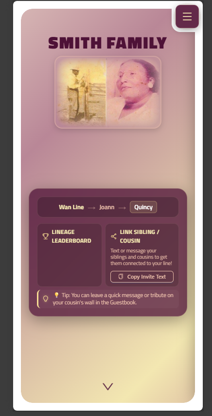
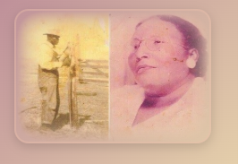
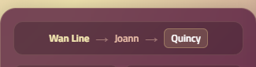
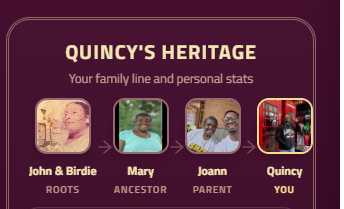
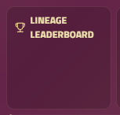
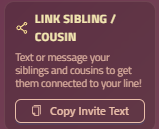
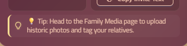

Hero Design Doc

Current Hero

Here is the breakdown of the conditional logic and state variables currently implemented in the homepage Hero CTA dashboard card (

NewHeroSection.js
):

🔑 State Variables & Flags
session: Tracks if the user is authenticated via Google (or mock authenticated in demo mode).
profile: Holds the user's database profile object. Checked for presence of profile.firstname.
hasFamilyConnections: Evaluated on mount/update. Queries the database and returns true if:
The user has an active connection of type spouse in the connection table.
The user has children in the profile table (profiles where parent === user.id).
This ensures spouses and tangential family members are never over-prompted to connect their parent.
lineageTrail: An object { ancestor, parent, me } containing the names of the user's lineage chain, queried dynamically.
🖥️ Display States & Conditions
State A: Guest View
Condition: !session (and database load finished).
UI Displays:
Welcome plaque text: "Explore Our Living Heritage"
A prompt describing the portal's features.
Two buttons: Sign In with Google and Join / Claim Profile with Google (both routing to /#/register).
State B: Onboarding Fallback
Condition: session && (!profile || !profile.firstname)
UI Displays:
Plaque text: "Let's set up your profile"
CTA: Claim or Create Profile Card (routing to /#/onboarding).
Note: Under normal operation, the global layout middleware (NewLayout.js) automatically redirects this user to onboarding before they see the home slide.
State C: Unconnected Lineage Prompt
Condition: session && profile && profile.parent === null && profile.ancestor === null && !hasFamilyConnections
UI Displays:
Warning card: "Connect to the Family Tree 🌳"
CTA: Find My Branch & Connect.
Behavior: Clicking the button opens the Ant Design bottom-sheet Drawer Overlay containing the multi-step Lineage Builder wizard:
Step 1: Grid of the 11 original branch leaders (children of John & Birdie).
Step 2: Relationship question: "Is [Name] your Parent, Grandparent, or Great-Grandparent?"
Step 3 & 4: Selection lists for intermediate generations.
Step 5: Confirmation card showing parent details (checks profile status to connect instantly if deceased/unclaimed, or sends a connection request if active).
Step 6: Success screen displaying their calculated generation badge (e.g. "4th Generation").
State D: Orphaned Parent Prompt
Condition: session && profile && profile.parent !== null && profile.ancestor === null
UI Displays:
Warning card: "Link Your Parent to Tree 🌳"
Description: "You've connected to your parent, but their branch is not yet connected to our first branch ancestors..."
CTA: Link Parent to Ancestor (routing to /parentform/smithparent/${profile.parent}).
State E: Connected User Dashboard (Happy Path)
Condition: session && profile && ((profile.parent !== null && profile.ancestor !== null) || (profile.parent === null && profile.ancestor !== null) || (profile.parent === null && hasFamilyConnections))
UI Displays (3-Row Stacked Dashboard):
Row 1: Lineage Trail: Dynamic horizontal path showing: [Ancestor] Line ➔ [Parent] ➔ [Me] (with a (Spouse) badge appended to the user's name if they are a connected spouse).
Row 2: Action Cards:
Photo Banner: Only visible if profile.avatar_url is null. Prompts to upload a profile photo.
Lineage Leaderboard Card: Displays the top 3 branches ranked by active members (dynamically computed and grouped by ancestor with parent-trace backfalls) and a commentary badge (e.g. "🏆 Mary Line is leading!").
Invite Card: Prompts to message siblings/cousins with a copy-to-clipboard invite text button.
Row 3: Tips Carousel: Automatically rotates helpful tip cards every 6 seconds.

Ok, lets work from c on down.
We have a few things at play
-The hero slide
-The profile information
-What are we prompting

Design

First

Remove the border or whatever it is causing the hero to not blend in with the background. its supposed to fit seemless with the background. 

Lineage line

Lets improve upon this

Lets change it to the section we have from the heritag slide

Lets have it in 3 avatars
with the overlying concept
[branch 1] -> [parent] -> [you]

For the different conditions
profile.parent === null && profile.ancestor === null
[empty] -> [empty] -> [you]

tapping on the button  prompts to wizard adding person. We can hve the warning card "Connect to the Family Tree 🌳" cta. But it needs to be smart to understand that the left one is ancestor, the middle is parent. but also if you go ancesetor first, we need to make sure when completing the profile form for aparent that it completes the correct profile table columns.

But what happens ifyou are a a child of the first branch
[branch 1] -> [you] -> [child]
if they do not have  child connection we can have a promp card requestng to fill in a child or for them to complete they do not have a child.  and we can then do a center with 2 avatars

for profile.parent === yes && profile.ancestor === null
[empty] -> [parent] -> [you]
then we do the cta to complete parent profile, this will tie into further prompting on completing a connection profile instruction set that we need todo. add this to your todo for later focusing. right now we are strictly ont eh ehro improvement.

for profile.parent === null && profile.ancestor === yes
[branch 1] -> [empty] -> [you]
then we do the cta to complete parent profile, this will tie into further prompting on completing a connection profile instruction set that we need todo. add this to your todo for later focusing. right now we are strictly ont eh ehro improvement.

This section still is not working. we need to ensure that the fetch is working. 

This column can be changed for connections. so upon fetching profiles, we also need to check the users connectoins, do they have a spouse, or children? this is where we canpromp that here. but also we need conditions for additional children incase they have more than one. we need to be smart about that. put this onthe todo list...we need some indicationbecause we do not always want to prmpt for more children if they do not have naymore. we need to be able to add some sort of system that allwos for a "happy path" profile has all current connections.

this section si good but lets add another row with the link sibling/cousin copy invite prmompt below this.

also right now the styling of the overall component is mishmatch. it neeeds to take u the entire viewport and be responsive. 